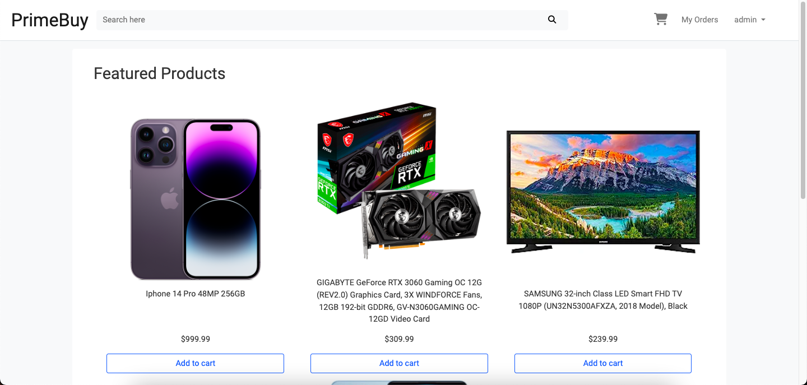
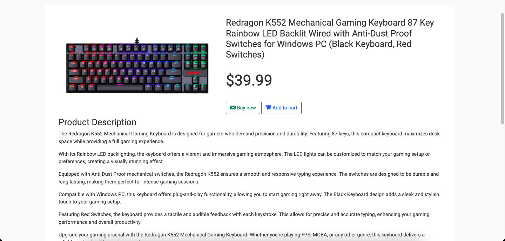
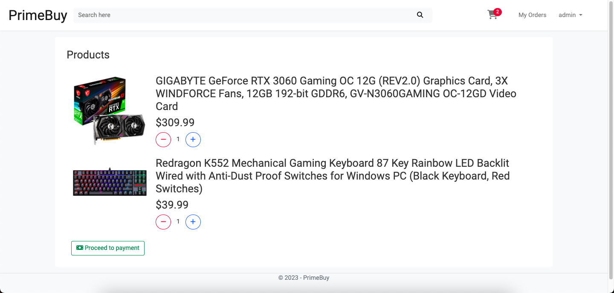
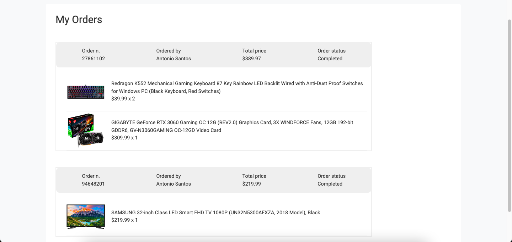
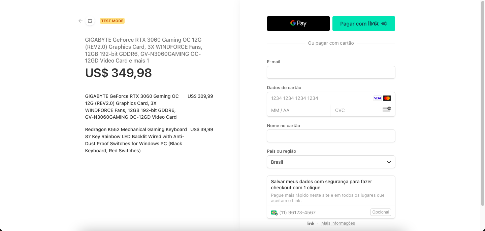

### O PrimeBuy é um projeto feito em .NET utilizando o MVC. Ele é um e-commerce simples que tem os principais recursos que um site do tipo poderia ter. Tais como: Cadastro de usuário, serviço de autenticação, serviço de pedidos e de carrinho, serviço real de pagamentos utilizando o Stripe, dentre outras coisas.
### A versão utilizada do .NET é a versão 6, mais especificamente a versão 6.0.15

 

### Nesse projeto, foram usadas as seguintes tecnologias e recursos além do C#:

 

<ul>
<li>JavaScript</li>
<li>JQuery</li>
<li>Bootstrap</li>
<li>PostgreSQL para banco de dados</li>
<li>Stripe para serviços de pagamento</li>
</ul>

### Algumas imagens do projeto:
<h3>Home page</h3>

<h3>Página de visualização do produto</h3>

<h3>Carrinho de compras</h3>

<h3>Página de pedidos do usuário</h3>

<h3>Página do Stripe com os produtos</h3>

